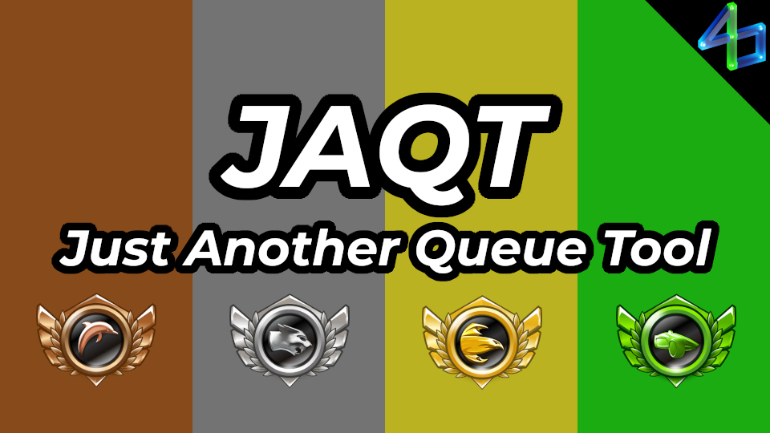

# JAQT (Just Another Queue Tool)

Queue for 2v2.

Inspired by AFK Queue Tool and works if your partner is using that plugin instead.

Thank you Fort for helping test and critique the plugin before release!

